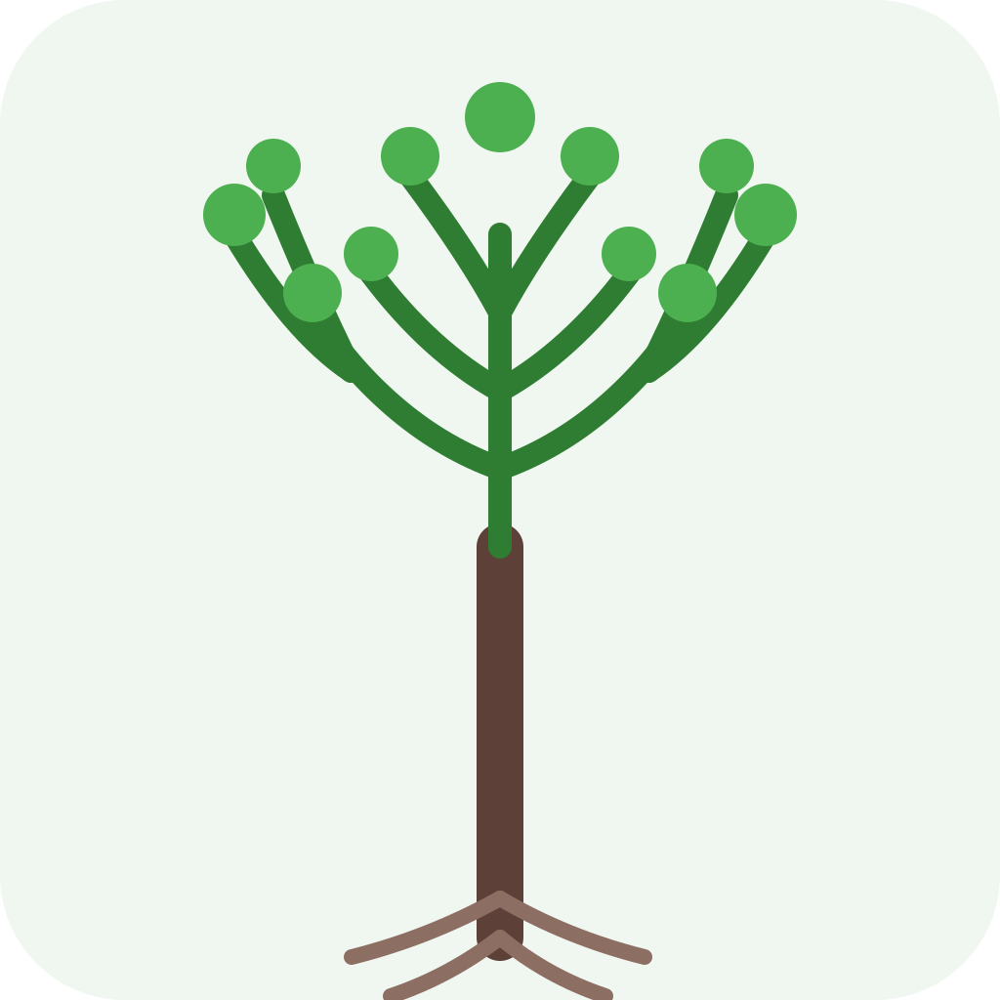
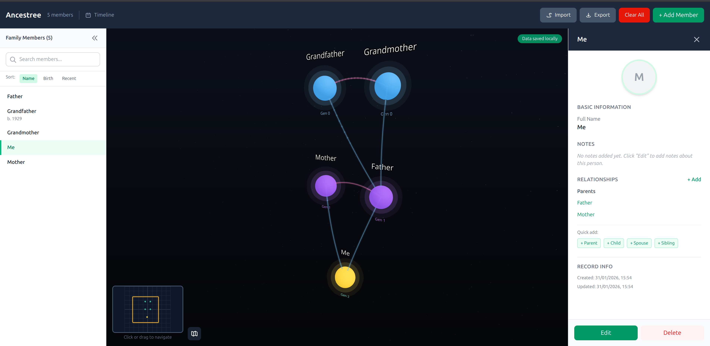
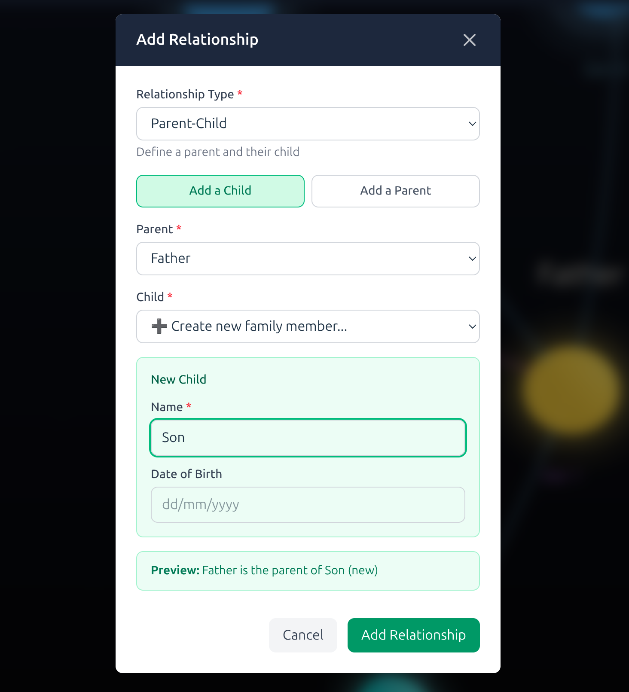
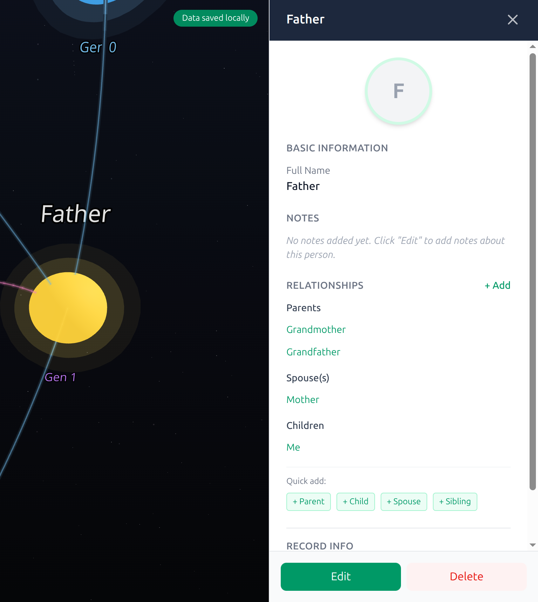

# Ancestree

**Interactive 3D Family Tree Visualization**

<p align="center">
  
</p>

Ancestree is a desktop application for visualizing and exploring your family history through an interactive 3D experience. Unlike static genealogy websites, Ancestree lets you navigate your family tree spatially, making complex relationships intuitive to understand.

<p align="center">
  
</p>

## Features

- **3D Visualization** — Navigate your family tree in an interactive 3D space. Zoom, pan, and rotate to explore relationships from any angle.
- **Cross-Platform** — Available for macOS, Windows, and Linux.
- **Works Offline** — Your data stays on your computer. No account or internet connection required.
- **GEDCOM Export** — Export your family tree to GEDCOM 7.0 format for compatibility with other genealogy software.
- **Auto-Save** — Changes are automatically preserved. Never lose your work.
- **Auto-Updates** — Receive in-app notifications when new versions are available.

## Installation

### Download

Download the latest release for your platform:

| Platform | Download |
|----------|----------|
| **macOS** | `Ancestree-x.x.x.dmg` |
| **Windows** | `Ancestree-Setup-x.x.x.exe` |
| **Linux** | `Ancestree-x.x.x.AppImage` or `ancestree_x.x.x_amd64.deb` |

### Platform Notes

**macOS:** Double-click the `.dmg` file, then drag Ancestree to your Applications folder.

**Windows:** Run the installer and follow the prompts. You may see a SmartScreen warning for unsigned builds — click "More info" then "Run anyway".

**Linux (AppImage):** Make the file executable and run it:
```bash
chmod +x Ancestree-*.AppImage
./Ancestree-*.AppImage
```

**Linux (Debian/Ubuntu):**
```bash
sudo dpkg -i ancestree_*_amd64.deb
```

## Getting Started

### Creating Your First Family Tree

1. **Launch Ancestree** — The app opens with an empty tree.
2. **Add a family member** — Click the "+ Add Member" button in the top right.
3. **Enter details** — Fill in name, dates, birthplace, and any notes.
4. **Create relationships** — Select a person and use the quick-add buttons to add parents, spouse, or children.

<p align="center">
  
</p>

5. **Explore in 3D** — Use your mouse to navigate:
   - **Scroll** — Zoom in/out
   - **Left-click + drag** — Rotate the view
   - **Right-click + drag** — Pan the view
   - **Click a node** — View and edit person details

<p align="center">
  
</p>

### Saving Your Work

- **Auto-save:** Changes save automatically to browser storage
- **Export to file:** Use `File → Save As` to save a `.json` file you can back up or share

## Keyboard Shortcuts

| Action | macOS | Windows/Linux |
|--------|-------|---------------|
| New file | `⌘ + N` | `Ctrl + N` |
| Open file | `⌘ + O` | `Ctrl + O` |
| Save | `⌘ + S` | `Ctrl + S` |
| Save As | `⌘ + Shift + S` | `Ctrl + Shift + S` |
| Undo | `⌘ + Z` | `Ctrl + Z` |
| Redo | `⌘ + Shift + Z` | `Ctrl + Shift + Z` |
| Quit | `⌘ + Q` | `Alt + F4` |

## File Formats

### Native Format (`.json`)

Ancestree saves family trees as JSON files with this structure:

```json
{
  "members": [
    {
      "id": "uuid",
      "name": "John Smith",
      "dateOfBirth": "1950-03-15",
      "placeOfBirth": "Boston, MA",
      "dateOfDeath": "2020-11-22",
      "notes": "Served in the Navy"
    }
  ],
  "relationships": [
    {
      "id": "uuid",
      "type": "parent-child",
      "person1Id": "parent-uuid",
      "person2Id": "child-uuid"
    }
  ]
}
```

### GEDCOM Export

Export your tree to GEDCOM 7.0 via `File → Export → GEDCOM`. This format is compatible with:
- Ancestry.com
- FamilySearch
- MyHeritage
- Gramps
- And most other genealogy software

## Family Member Fields

| Field | Description | Format |
|-------|-------------|--------|
| Name | Full name | Text |
| Date of Birth | Birth date | `YYYY-MM-DD` |
| Place of Birth | Birth location | Text (city, state, country) |
| Date of Death | Death date (if applicable) | `YYYY-MM-DD` |
| Notes | Additional information | Free text |
| Photo | Profile picture | Uploaded image |

## Relationship Types

- **Parent-Child** — Connects a parent to their child
- **Spouse** — Marriage or partnership (includes optional marriage/divorce dates)
- **Sibling** — Brother/sister relationship

## System Tray

Ancestree runs in your system tray for quick access:

- **macOS:** Click the menu bar icon to show the context menu
- **Windows/Linux:** Click the tray icon to toggle the window

The tray menu includes:
- Current file name (if open)
- Show/Hide window
- Check for updates
- Quit

## Updating

Ancestree checks for updates automatically on launch. When an update is available:

1. An in-app notification appears at the top of the window
2. Click "Download" to fetch the update
3. Restart the app to install

You can also check manually via the system tray menu.

## Troubleshooting

### App won't launch on macOS

If you see "Ancestree is damaged and can't be opened":
```bash
xattr -cr /Applications/Ancestree.app
```

### Window doesn't appear

Try clicking the system tray icon, or:
- **macOS:** Check if the window is on another desktop/space
- **Windows/Linux:** Check the taskbar for the Ancestree icon

### Data not saving

- Ensure you have write permissions to the save location
- Try `File → Save As` to a different location
- Check that your disk isn't full

### 3D view is slow

- Close other GPU-intensive applications
- Try reducing the window size
- On laptops, ensure you're plugged in (integrated graphics may throttle on battery)

## Building from Source

### Prerequisites

- Node.js 20 or 22 (v24 has compatibility issues with Electron)
- npm 9+

### Development

```bash
# Clone the repository
git clone https://github.com/yourusername/ancestree.git
cd ancestree

# Install dependencies
npm install

# Start development server (web only)
npm run dev

# Start Electron development mode
npm run dev:electron

# Run tests
npm run test

# Build for production
npm run build:electron

# Package for current platform
npm run pack
```

### Platform-Specific Packaging

```bash
# macOS
npm run pack:mac

# Windows
npm run pack:win

# Linux
npm run pack:linux
```

## Tech Stack

- **Framework:** React 19 + TypeScript + Vite 7
- **Desktop:** Electron 40
- **3D Rendering:** Three.js via react-three-fiber
- **Storage:** IndexedDB (via Dexie.js)
- **Styling:** Tailwind CSS v4
- **Testing:** Vitest + React Testing Library

## Data Privacy

- **Local-first:** All data is stored on your computer
- **No telemetry:** The app doesn't collect usage data
- **No account required:** Use Ancestree without creating an account
- **Your data, your control:** Export anytime to JSON or GEDCOM

## Contributing

Contributions are welcome! Please:

1. Fork the repository
2. Create a feature branch (`git checkout -b feature/amazing-feature`)
3. Make your changes
4. Run tests (`npm run test`)
5. Commit (`git commit -m 'Add amazing feature'`)
6. Push (`git push origin feature/amazing-feature`)
7. Open a Pull Request

## License

MIT License — see [LICENSE](LICENSE) for details.

## Acknowledgments

- [Three.js](https://threejs.org/) for 3D rendering
- [Electron](https://www.electronjs.org/) for cross-platform desktop support
- [react-three-fiber](https://github.com/pmndrs/react-three-fiber) for React integration
- The genealogy community for GEDCOM standardization

---

**Made with care for families everywhere.**
